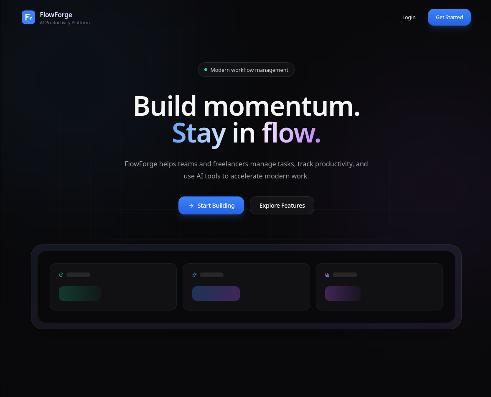
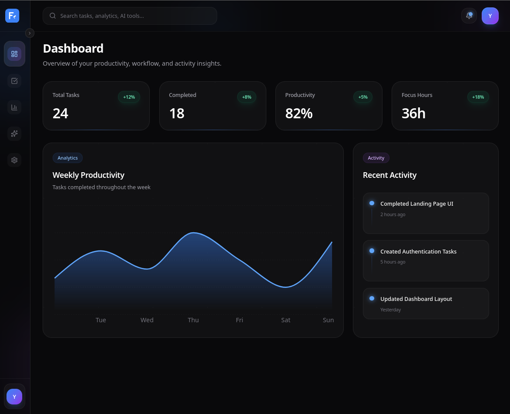
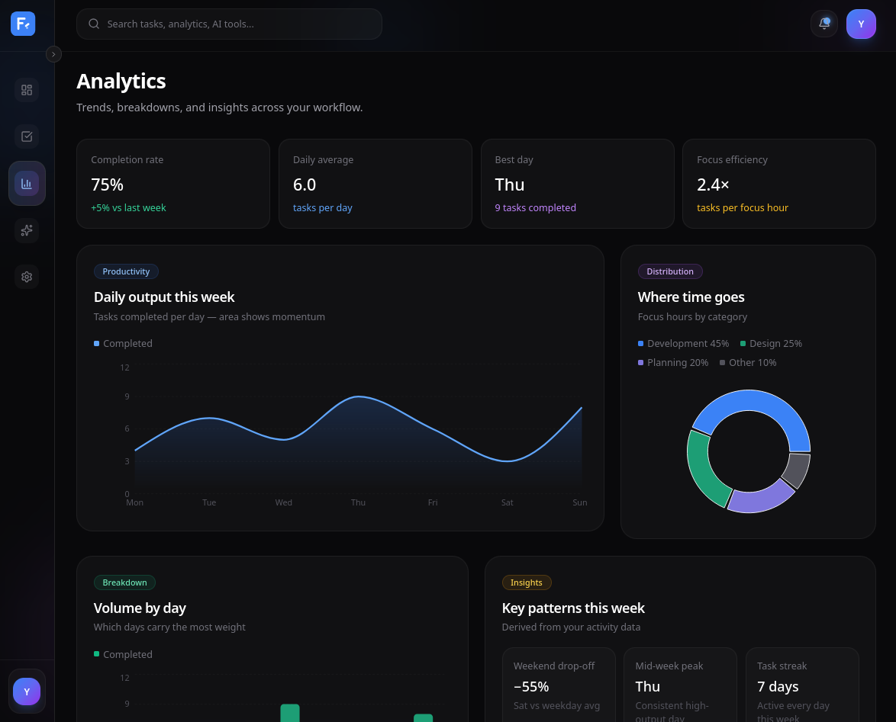
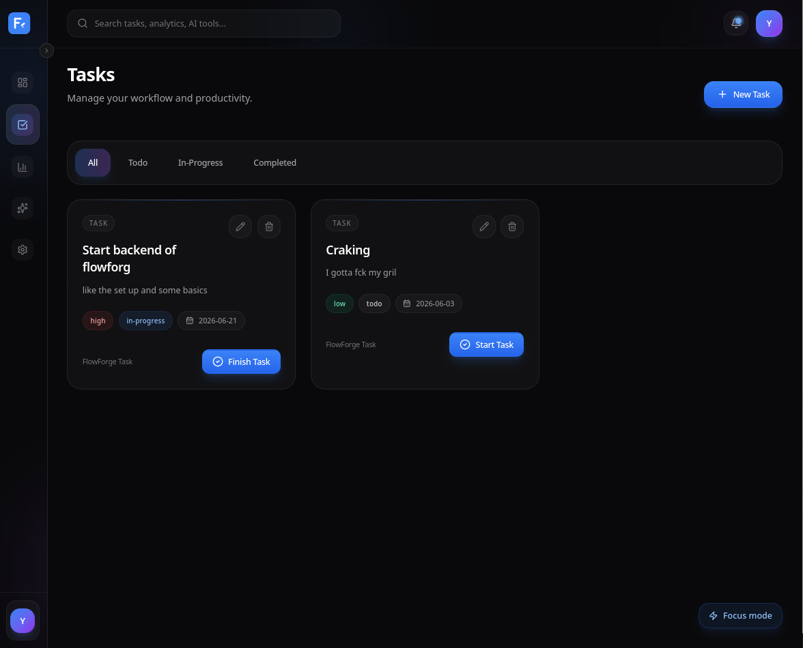
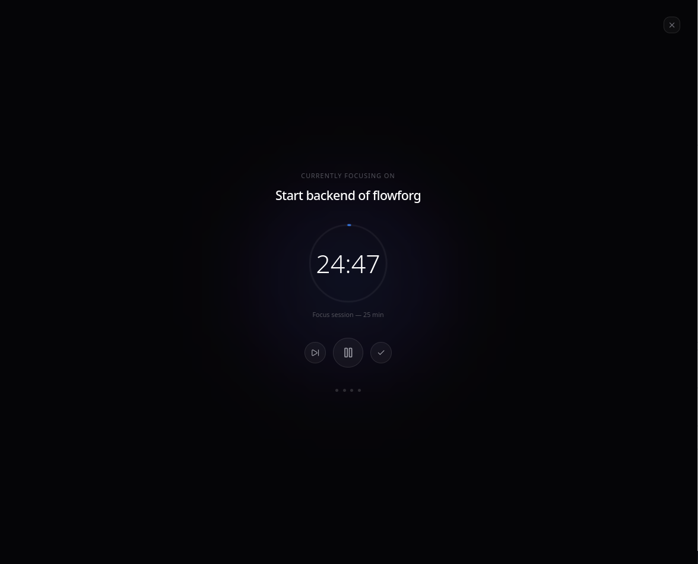

<div align="center">
  

  <h1>FlowForge</h1>
  <p><strong>An AI-powered productivity platform for managing tasks, tracking analytics, and staying in flow.</strong></p>

  <p>
    <a href="#">Live Demo</a> ·
    <a href="https://github.com/Yeabtsega-Tesfaye/FlowForge/issues">Report Bug</a> ·
    <a href="https://github.com/Yeabtsega-Tesfaye/FlowForge/issues">Request Feature</a>
  </p>

  <br />

  
  
  
  
  
</div>

<br />

<div align="center">
  
  
</div>

<br />

## About

FlowForge is a productivity platform built around a simple question — what would a task manager feel like if it took design as seriously as a startup landing page?

It's a solo deep-dive into production-grade frontend architecture: 50+ files of components, services, and stores held together by one consistent design language. The frontend is complete. The backend — Node.js, Express, PostgreSQL, and Prisma — is in progress.

<br />

## Features

<table>
<tr>
<td width="50%" valign="top">

**Dashboard**
Weekly productivity at a glance — animated charts, live stat cards, recent activity feed.

**Analytics**
Deeper insight into how you work: completion rate, time distribution, peak focus days, derived patterns like weekend drop-off.

**Tasks**
Full task management with status workflows, priority levels, and due dates.

**Focus Mode**
A full-screen, distraction-free Pomodoro timer — one task at a time, with a breathing ambient glow. Completing a session updates your real task list.

</td>
<td width="50%" valign="top">

**AI Assistant**
A chat interface built as an intelligent productivity co-pilot. *(UI complete, AI integration in progress.)*

**Settings**
Profile, notifications, integrations, and account controls in a clean sub-navigation layout.

**Command Palette**
Keyboard-first navigation across the whole app — `⌘K` from anywhere.

**Collapsible Sidebar**
Click to collapse, hover to preview. State persists across sessions.

</td>
</tr>
</table>

<br />

<details>
<summary><strong>See more screenshots</strong></summary>
<br />


<br /><br />

<br /><br />


</details>

<br />

## Stack

| | |
|---|---|
| **Frontend** | React · Vite · Tailwind CSS · Zustand · Framer Motion · Recharts · React Router |
| **Backend** *(in progress)* | Node.js · Express · PostgreSQL · Prisma · JWT |
| **Infra** | Neon (database) · Render (API) · Netlify (frontend) |

<br />

## Architecture

The frontend follows a service-layer pattern — components never touch mock data directly. Every read goes through `src/services/`, so when the backend ships, only the service files change. Nothing else.

```
src/
├── components/      feature-organized: ai, analytics, dashboard, focus,
│                    notifications, settings, tasks, ui
├── pages/           route-level views
├── layouts/         DashboardLayout, PublicLayout
├── routes/          route definitions
├── services/        data access layer — swaps mock data for live API later
├── store/           Zustand stores — tasks, notifications, theme, sidebar, focus
└── data/            mock data (temporary)

server/              Express + Prisma API — in progress
```

<br />

## Getting started

```bash
git clone https://github.com/Yeabtsega-Tesfaye/FlowForge.git
cd FlowForge
npm install
npm run dev
```

Runs at `http://localhost:5173`.

<br />

## Roadmap

- [x] Frontend architecture & design system
- [x] Dashboard, Analytics, Tasks, Settings
- [x] Focus Mode, Command Palette
- [x] Responsive layout
- [ ] Express + PostgreSQL backend
- [ ] Authentication
- [ ] Live task & analytics APIs
- [ ] Real AI integration
- [ ] Deployed demo

<br />

## Author

**Yeabtsega Tesfaye** — Software Engineering, Woldia University
[GitHub](https://github.com/Yeabtsega-Tesfaye) · [Portfolio](https://yeab-tsega.netlify.app)

<br />

<div align="center">
<sub>MIT License</sub>
</div>
